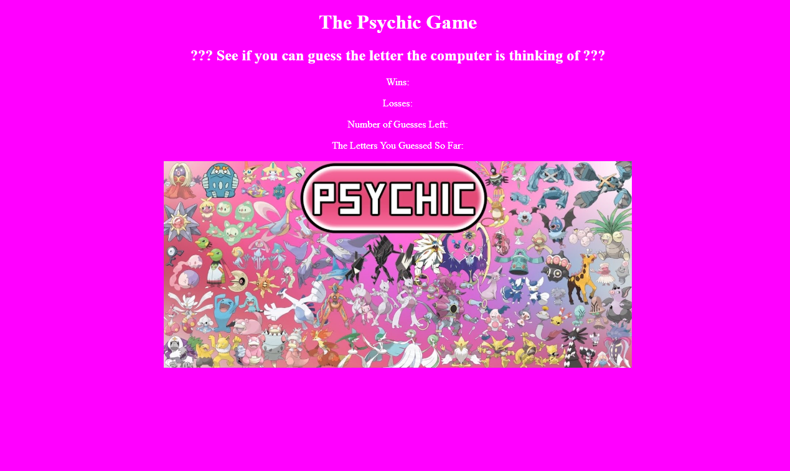

# Psychic-Game

## Overview

This project was an example of a psychic guessing game using Javascript. The objective of this game is to have the user match the same letter of the alphabet (a through z) that the computer has randomly selected within 9 attempts.

---

## Instructions

Type any letter on the keyboard to start. The user has 9 chances to guess the same letter that the computer has randomly selected. 
With correct guess the wins increase by 1. After all 9 guesses are used without success, the losses increase by 1. The game will resent when you win or lose.

---

## Technologies Used
* HTML
* Bootstrap
* Javascript

---

## File Structure

-Root
* index.html
* assets
    * css
        * reset.css
        * style.css
    * javascript
        * game.js
    * images

---
## Deployed Link:

[Psychic Game](https://bwilson1990.github.io/Psychic-Game/)

---

## Screenshot

